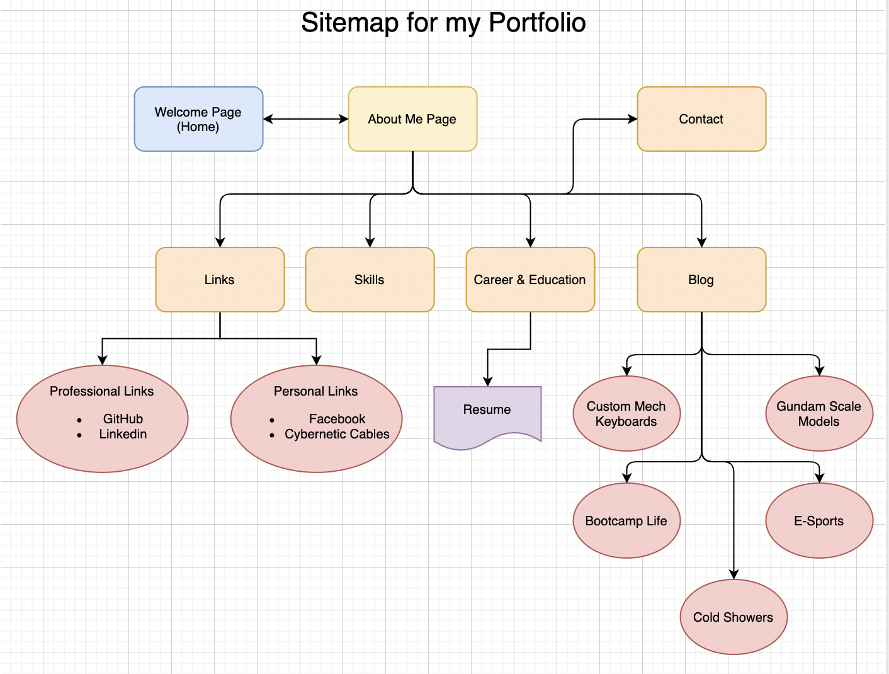
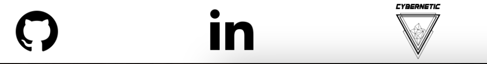
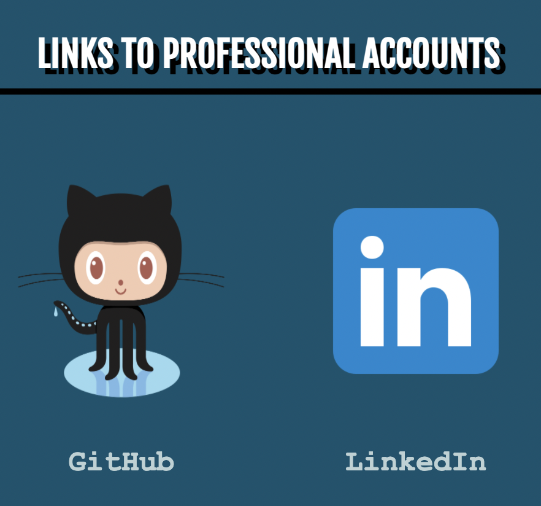
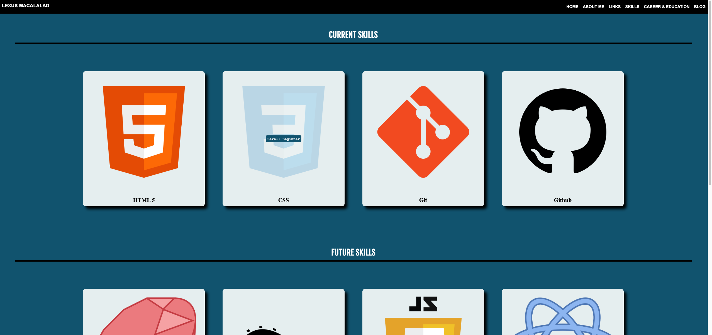

# Portfolio Documentation

By: Lexus Macalalad

## Links to Portfolio
[Github](https://github.com/lexusmacalalad/main-portfolio) repository

[Portfolio](https://lexus-portfolio.netlify.app/) website

## Purpose of the Portfolio
There main purpose of this portfolio is to demonstrate my knowledge and skills not only to my peers and educators, but also to any potential recruiters/employers.

This portfolio also serves as a guideline as to what my current skill level is for front end web development. This will be a great resource for my personal development and can be used as a base to compare how my skills have developed throughout the course.

## Target Audience
As mentioned earlier, the main target audience for this portfolio are the recruiters and employers that can potentially offer me a position at their company as either an intern or a full/part time employee.

However, it is also publicly available for anyone to see, especially stakeholders like my educators and peers. This can also serve as an ispiration to many future coding/programming students as this will most likely be replaced with an updated portfolio.

## Functionality / Features
The features of the portfolio will help my audience gain more understanding about myself. 

### Sitemap
I wanted my portfolio to start with a welcome page that linked to the "about me" page. From there, the audience are able to access everything else. From there, users can view my resume from the career and education page and also visit external links for blogs relating to my interest. This can be explained more with the diagram below

### Page Sections
The purpose of having different page sections is for the audience to quickly identify what specific section about me they are viewing. This will provide them of a brief overview of what to expect on the page they are on.

### Navigation Menu
To support the page section feature, a navigation menu is also included so that the target audience can quickly access what page they want to access with the click of a button. This navigation will always be accessible by the user as it will always be shown on top of the screen. This navbar is compressed into a hamburger menu when viewed on a mobile phone.

The navbar also extends into a horizontal navbar to make the portfolio page more responsive when viewed on larger screens.

### Footer
Along side the *navigation* menu, a footer menu was also included to link my most important social links like *GitHub* and *Linkedin* profiles.

### Links
There are many external links included in the portfolio. The most important ones being the ones linking to my professional pages such as *GitHub* and *Linkedin* and link to my ***resume*** file. There are also links that will explain some of my interests in more detail in the *blog* section.

### Transitions
It's important to keep the audience engaged while viewing the portfolio to relieve boredom. To try and achieve this, I have included transitions and pseudo code that makes the website appear more interesting. For example, when hovering over the skills cards on the skills page, the skill card will turn transparent which will then reveal my skill level with that certain language.

### Techstack
The following techstack were used to create my portfolio website:
- HTML
- CSS
- Sass/Scss
- Netlify
- GitHub
- Git
- Visual Studio Code
- Terminal
- Chrome Dev Tools
- Balsamiq Wireframes
- draw.io
- Trello Board

